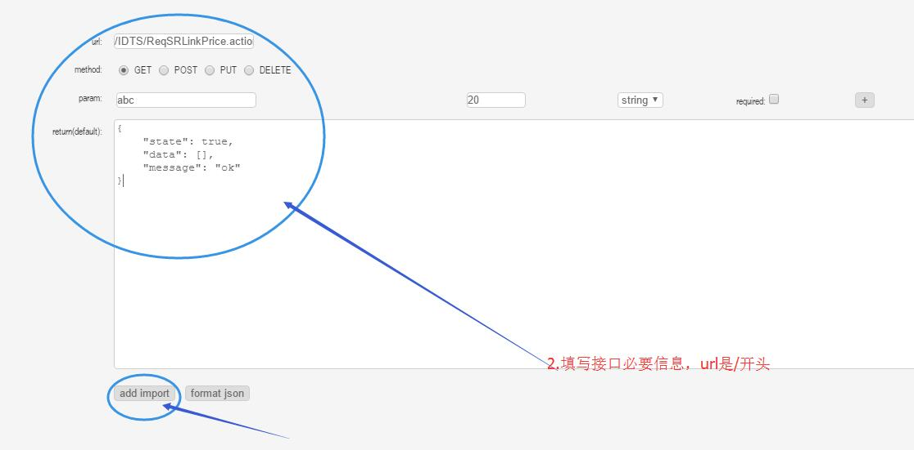
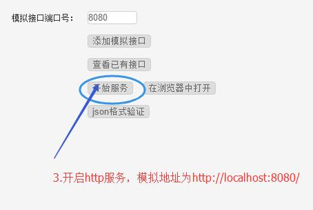

# mock工具
该工具可以模拟本地的http服务后端接口，以方便前端联调接口，支持多种请求类型，自定义url和参数。

本工具下载地址：
[https://tianxiangbing.github.io/mock/updates/mock.exe](https://tianxiangbing.github.io/mock/updates/mock.exe)
或者
[http://www.lovewebgames.com/app/mock/mock.exe](http://www.lovewebgames.com/app/mock/mock.exe)
或者绿化版本
[http://www.react-cn.com/app/mock/mock.rar](http://www.react-cn.com/app/mock/mock.rar)

**源码地址：[https://github.com/tianxiangbing/mock](https://github.com/tianxiangbing/mock)**
# 使用方法

1. 新增接口

2. 输入接口必要信息，添加进配置文件

3. 返回至主界面，启动服务

4. 查看已有接口界面可以对现有接口进行编辑和删除

5. 每一次接口和添加或修改，必须重启服务才会生效

6. 主界面的json格式验证，提供一个快捷的json格式验证和格式化工具.

