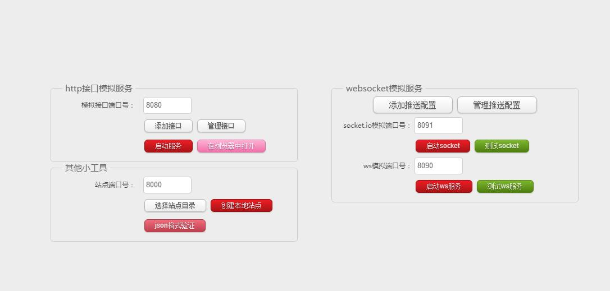
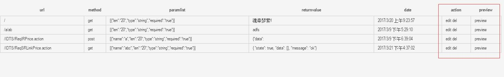
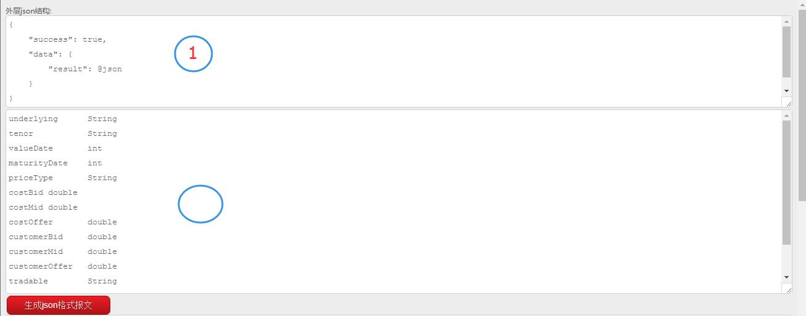
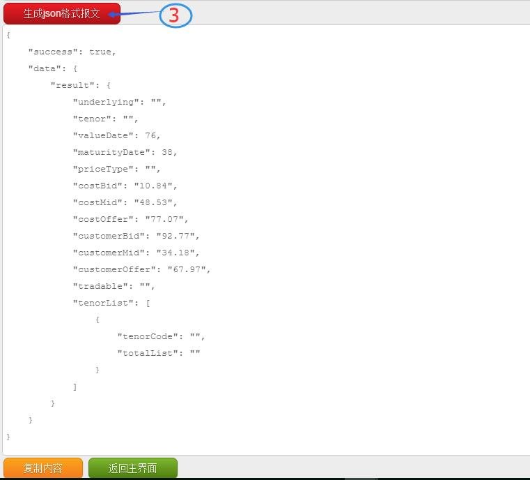

# mock工具
该工具可以模拟本地的http服务后端接口，以方便前端联调接口，支持多种请求类型，自定义url和参数。针对由socket.io和websocket的推送服务进行的不同的支持。
socket.io的服务直接基于当前的http服务，websocket服务要设置不同的端口号。调用方式与官方接口一致。

本工具下载地址：

[https://raw.githubusercontent.com/tianxiangbing/mock/download/mock.exe](https://raw.githubusercontent.com/tianxiangbing/mock/download/mock.exe)

## [历史版本下载](https://tianxiangbing.github.io/mock/download)

## 功能预览

**源码地址：[https://github.com/tianxiangbing/mock](https://github.com/tianxiangbing/mock)**
# 使用方法

1. 新增接口

2. 输入接口必要信息，添加进配置文件

3. 返回至主界面，启动服务

4. 查看已有接口界面可以对现有接口进行编辑和删除

5. 每一次接口和添加或修改，必须重启服务才会生效

6. 主界面的json格式验证，提供一个快捷的json格式验证和格式化工具.

7. Socket.io推送消息如上面步骤类似，需要先启用http服务

    socket = io.connect('http://localhost:8080');
    socket.emit('message', '测试成功!');
    socket.on('message', function (data) {
        $('#sctips').html(data);
    });

8. websocket推送消息不同于socket.io,需要单独设立端口号

    const ws = new WebSocket('ws://localhost:8090/ws');
    ws.on('message', function incoming(data) {
        $('#wstips').html(data)
    });

9. 新增本地目录建站点

    选择本地文件夹目录，指定端口号，即可开启本地的http静态资源映射。http://localhost:8000

10. 新增md5文件加密
11. 新增修改exe的icon图标
12. 接口文档快速转换成json格式

